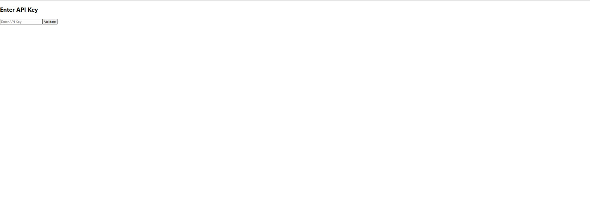
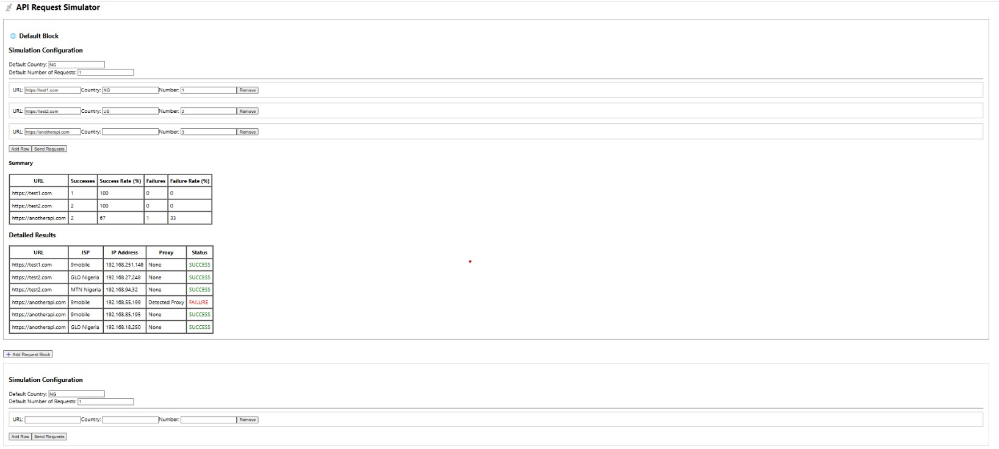

# REACT-API

A fullstack web application that simulates API requests to multiple endpoints concurrently, tracks response status, and displays summary analytics in real-time.

## Live Demo

Frontend (Vercel): [https://react-api-gamma-olive.vercel.app](https://react-api-gamma-olive.vercel.app)  
Backend (Render): 🔗 Backend API: [https://react-api-backend.onrender.com](https://react-api-backend.onrender.com)

---
## Screenshots

### API Key Validation Page

### API Simulator Dashboard

---

## Features

- Validate and secure API access via key entry.
- Simulate API requests with user-defined configurations.
- Concurrent request handling with dynamic results.
- Real-time summary and detailed results (success rate, failure rate).
- Support for multiple countries, ISPs, and proxy detection.
- Clean and responsive UI.

---

## Tech Stack

### Frontend
- React.js (Create React App)
- HTML, CSS, JavaScript
- Deployed on **Vercel**

### Backend
- Node.js + Express.js + MongoDB
- API mocking and response simulation
- Deployed on **Render**

---

## How It Works

1. **API Key Page**:  
   Users enter their API key to unlock the simulator.

2. **Simulation Dashboard**:
   - Add multiple URLs and define the number of simulated requests.
   - The app fetches responses concurrently.
   - Results are displayed in summary and detailed formats.
   - Failure cases (e.g., proxy detected) are highlighted.

---

## Local Setup Instructions

### Clone the repository
git clone https://github.com/Abdulrahman843/react-api.git
cd react-api

### Setup backend
cd backend
npm install
npm start

### Setup frontend (in new terminal/tab)
cd ../frontend
npm install
npm start

## Author
Abdulrahman Laoye
Web & Mobile App Developer | Civil Engineer
LinkedIn: https://www.linkedin.com/in/abdulrahman-adewale-laoye-0bb28b105 • Portfolio: https://abdulrahman-portfolio-eight.vercel.app/

## License
This project is open-source and available under the MIT License.
